# 🛡️ Awesome Remote Browser Isolation (RBI)

<p align="center">
  
</p>

<p align="center">
  <a href="https://github.com/ishandutta2007/Awesome-Awesome-Awesome"></a>
  <a href="https://discord.gg/jc4xtF58Ve"></a>
  <a href="https://github.com/ishandutta2007/Awesome-Remote-Browser-Isolation/stargazers"></a>
  <a href="https://github.com/ishandutta2007/Awesome-Remote-Browser-Isolation/network/members"></a>
  <a href="https://github.com/ishandutta2007/Awesome-Remote-Browser-Isolation/issues"></a>
  <a href="https://github.com/ishandutta2007/Awesome-Remote-Browser-Isolation/blob/main/LICENSE"></a>
  <a href="https://github.com/ishandutta2007/Awesome-Remote-Browser-Isolation/pulls"></a>
  <a href="https://github.com/ishandutta2007"></a>
</p>

---

## 🌟 Overview & Architecture

**Remote Browser Isolation (RBI)** is a zero-trust cybersecurity technology that executes web browsing sessions inside a disposable, isolated cloud or containerized environment—physically separating end-user devices and corporate networks from the public internet. By streaming safe, interactive rendering (pixels or sanitised vector instructions) rather than allowing active code (JavaScript, WebAssembly, HTML5 payloads) to run locally, RBI delivers **100% protection against drive-by downloads, zero-day browser exploits, ransomware, phishing, and evasive web-borne threats**.

```
┌─────────────────┐       Safe Stream (Pixels / NVR)      ┌────────────────────────┐
│  Local Endpoint │ ◄──────────────────────────────────── │ Remote Cloud Container │
│ (Zero Execution)│ ────────────────────────────────────► │  (Isolated Chromium)   │
└─────────────────┘        Encrypted User Input (K/M)     └───────────┬────────────┘
                                                                      │ Active Web Content
                                                                      ▼ (Malware / Zero-Days Isolated)
                                                           ┌────────────────────────┐
                                                           │   Untrusted Internet   │
                                                           └────────────────────────┘
```

### 🔑 Core RBI Approaches
* 🖼️ **Pixel Pushing (Video/WebRTC Streaming)**: Browser renders inside remote container; an interactive video or WebRTC/VNC stream is pushed to the client. Zero code executes locally.
* ⚡ **DOM Reconstruction & Network Vector Rendering (NVR)**: Strips dangerous JavaScript and active content, streaming clean vector draw commands to the local browser for near-native latency and high fidelity.
* 🏢 **Secure Enterprise Browsers (SEB)**: Hardened enterprise Chromium browsers enforcing deep DLP, clipboard controls, identity-aware access, and selective isolation for high-risk destinations.

---

## 📑 Table of Contents
* [☁️ SaaS / Hosted Commercial Platforms](#-saashosted-commercial-platforms)
* [💻 Open-Source GitHub Projects](#-open-source-github-projects)
* [🔬 Key RBI Architecture Patterns](#-key-rbi-architecture-patterns)
* [🤝 How to Contribute](#-how-to-contribute)
* [📈 Star History](#-star-history)
* [📜 Disclaimer](#-disclaimer)

---

## ☁️ SaaS/Hosted Commercial Platforms

> 📊 **Estimated Market Size & Industry Concentration**:  
> The global Remote Browser Isolation (RBI) and enterprise secure browsing market is estimated at **$1.38B – $2.53B in 2026** and projected to expand to **$3.65B – $5.0B+ by 2030–2032** (25–30% CAGR). The sector is **moderately concentrated and rapidly consolidating**, characterized by mega-cap SASE and Zero-Trust network security providers (Broadcom, Palo Alto Networks, Cloudflare, Netskope) integrating RBI natively into Security Service Edge (SSE) suites, while specialized enterprise secure browser vendors (Island, Menlo Security, Authentic8) maintain dominant standalone enterprise moats.

*All entries below are strictly sorted in descending order by company size (market valuation or enterprise capitalization).*

| 🏢 Product / Platform | 📝 Description & Isolation Architecture | 💰 Company Size (Valuation / Revenue) | 🏷️ Pricing (Starting Tier) | 🎁 Free Tier / Free Trial Limits |
| :--- | :--- | :--- | :--- | :--- |
| [**Symantec Web Isolation**](https://www.broadcom.com/products/cybersecurity/network/web-isolation) | Enterprise-grade cloud & on-premise RBI leveraging air-gap DOM transformation and pixel rendering; deeply integrated with Symantec Cloud SWG and DLP. | **~$800B+ Market Cap** (Broadcom Inc. / NASDAQ: AVGO) | **$42.00 / user / year** (~$3.50/user/month) as an add-on license to Symantec Web Protection / Cloud SWG on enterprise schedules. | **30-Day Free Trial / PoC**: Available through authorized Broadcom Symantec enterprise partners with full tenant policies and DLP disarm testing. |
| [**Palo Alto Prisma Access Browser**](https://www.paloaltonetworks.com/sase/prisma-access-browser) | Enterprise secure browser and RBI technology (built on Talon Cyber Security acquisition) providing native Chromium isolation, Zero Trust access, and deep telemetry. | **~$110B+ Market Cap** (Palo Alto Networks / NASDAQ: PANW) | **$10.00 / user / month** ($99.00/user/year billed annually) for Prisma Browser for Business; enterprise tiers integrate with Prisma SASE. | **30-Day Free Trial**: Available for Prisma Browser for Business supporting up to 50 users with full threat prevention and SaaS governance; no permanent free plan. |
| [**Cloudflare Browser Isolation**](https://www.cloudflare.com/products/zero-trust/browser-isolation/) | Network Vector Rendering (NVR) browser isolation running on Cloudflare's global edge network; executes Chromium in edge workers and pushes safe vector draws. | **~$38B+ Market Cap** (~$1.6B+ ARR, NYSE: NET) | **$10.00 / user / month** add-on to Cloudflare Zero Trust (base Zero Trust seat starts at $7.00/user/month; $17.00/user/month combined). | **30-Day Evaluation / Free ZT Tier**: Zero Trust base tier is Free Forever for up to 50 users (ZTNA & DNS); RBI module requires requesting a 30-day enterprise evaluation. |
| [**Check Point Harmony SASE (Perimeter 81)**](https://www.checkpoint.com/harmony/sase/) | Cloud-delivered secure web gateway with Remote Browser Isolation to sanitize untrusted URLs, embedded links, and unknown web categories. | **~$20B+ Market Cap** (Check Point Software / NASDAQ: CHKP) | **$8.00 / user / month** (Essential tier, min 10 users) + **$4.00 / user / month** for RBI feature add-on ($12.00/user/month total). | **14-Day Free Trial / 30-Day Money-Back**: Evaluates up to 10 team seats with complete gateway security and isolated browsing; no permanent free plan. |
| [**Citrix Secure Private Access / Remote Browser**](https://www.citrix.com/products/citrix-secure-private-access/) | Clientless, cloud-hosted remote browser service that isolates end-user internet browsing and protects corporate networks from web-borne attacks without endpoint agents. | **~$16.5B Valuation** (Cloud Software Group / Vista Equity & Evergreen) | **$7.00 / user / month** ($84.00/user/year) for Secure Private Access Standard; RBI Advanced service bundles start at **$12.50 / user / month**. | **30-Day Free Trial**: Full access on Citrix Cloud supporting up to 25 user licenses with complete isolation policies and admin management; no permanent free plan. |
| [**LayerX Security**](https://layerxsecurity.com/) | Enterprise browser security platform offering seamless extension-based isolation, real-time phishing interception, and GenAI data loss prevention across all browsers. | **~$15B Market Cap** (Parent: Akamai Technologies; LayerX unit valued at ~$100M+) | **$60.00 / user / year** ($5.00/user/month) starting reference tier on AWS Marketplace for browser security extension monitoring. | **14 to 30-Day Proof of Concept (PoC)**: Guided enterprise evaluation with full GenAI data security, URL inspection, and real-time policy rules; no permanent free tier. |
| [**Netskope One RBI**](https://www.netskope.com/products/remote-browser-isolation) | Cloud-native isolation within Netskope SSE / Next-Gen SWG, dynamically isolating uncategorized and risky web traffic while preserving user experience. | **~$7.5B Valuation** (~$500M+ ARR, Private / Venture-Backed) | **£43.42 / user / year** (~$56.00/user/year or ~$4.67/user/month) for Targeted RBI (protects top 5% web traffic); £72.00/user/year for Extended RBI (25% traffic). | **30-Day Proof of Concept (PoC)**: Guided sandbox evaluation plus self-paced interactive test drives with full threat isolation; no permanent free tier. |
| [**Island (The Enterprise Browser)**](https://www.island.io/) | Dedicated Chromium-based Enterprise Browser engineered with built-in remote isolation, watermarking, clipboard restrictions, and Zero Trust app access controls. | **$3.3B Valuation** (Series D, April 2024 / Coatue & Sequoia Capital) | **$200.00 / user / year** (~$16.67/user/month) for Island Managed Browser seat license listed on UK G-Cloud (management console quoted separately). | **30-Day Proof of Concept (PoC)**: Tailored enterprise sandbox trial for qualified IT/security organizations to test policy enforcement; no permanent free tier. |
| [**Forcepoint Remote Browser Isolation**](https://www.forcepoint.com/product/remote-browser-isolation-rbi) | Zero-trust web isolation rendering all active web content remotely, streaming sanitised pixels to endpoints with Content Disarm & Reconstruction (CDR). | **~$2.5B Valuation** (Francisco Partners & TPG) | **£54.00 / user / year** (~$70.00/user/year or ~$5.83/user/month) on UK G-Cloud for Forcepoint Remote Browser Isolation seat licensing. | **30-Day Free Trial**: Full-featured trial including zero-trust policy orchestration, threat disarming, and download file sanitization; no permanent free tier. |
| [**Menlo Security**](https://www.menlosecurity.com/) | Pioneer in cloud-native Isolation Core™ technology providing 100% malware-free browsing via adaptive pixel streaming, HEAT phishing defense, and Secure Enterprise Browser. | **~$1.0B Valuation** (Unicorn / $260M+ funding, Vista & General Catalyst) | **£49.60 / user / year** (~$64.50/user/year or ~$5.38/user/month) on UK G-Cloud framework; commercial starting packages run ~$10.00–$20.00/user/month. | **30-Day Free Proof of Value (PoV)**: Hands-on evaluation with complete tenant isolation, file inspection, and zero-day threat defense; no permanent free tier. |
| [**iboss Cloud Platform & RBI**](https://www.iboss.com/) | Containerized cloud security architecture providing targeted and full remote browser isolation directly inside global micro-gateways. | **~$1.0B Valuation** (Francisco Partners & Goldman Sachs) | **£30.00 / user / year** (~$39.00/user/year or ~$3.25/user/month) starting price on UK G-Cloud for cloud security packages with selective isolation. | **30-Day Free Trial**: Available on iboss Cloud containerized gateway with full policy test coverage and traffic analytics; no permanent free tier. |
| [**Authentic8 Silo Workspace**](https://www.authentic8.com/products/silo-for-safe-access) | Cloud-native web isolation platform creating disposable, non-persistent browser containers in regional cloud nodes for high-security, OSINT, and regulated sectors. | **~$400M Valuation** (~$50M+ ARR, Trident Capital & Artis Ventures) | **$1,450.00 / user / year** (~$120.83/user/month) for Silo Local (access to single regional node); Multi-Region tier starts at $2,450.00/user/year. | **30-Day Free Trial**: Complete access to Silo Workspace with audit logging, secure cloud storage, and credential isolation; no permanent free tier. |
| [**Kasm Workspaces Cloud**](https://www.kasmweb.com/) | Streaming containerized disposable desktop and browser workloads delivered via WebRTC directly to any modern web browser. | **~$35M Valuation** (Self-sustaining & Profitable) | **$5.00 / user / month** ($60.00/user/year) for Professional Cloud SaaS; Enterprise SaaS tier starts at **$15.00 / user / month**. | **Free Forever Community Tier & 14-Day Cloud Trial**: Community Edition is Free Forever for up to 5 concurrent sessions (self-hosted); Cloud SaaS offers a 14-day free trial with 10 user seats. |

---

## 💻 Open-Source GitHub Projects

Open-source Remote Browser Isolation stacks, containerized browser streaming engines, WebRTC virtual browsers, and secure sandbox implementations.

*All repositories below are strictly sorted in descending order by GitHub star count.*

| 📦 Repository & Project | ⭐ GitHub Stars | 🛠️ Technology & Architecture | 🎯 Isolation Pattern |
| :--- | :--- | :--- | :--- |
| [**m1k1o/neko**](https://github.com/m1k1o/neko) | [](https://github.com/m1k1o/neko/stargazers) | Go, WebRTC, Vue.js, Docker, GStreamer | Self-hosted virtual browser running in Docker with ultra-low latency WebRTC streaming and collaborative multi-user browsing. |
| [**browserless/browserless**](https://github.com/browserless/browserless) | [](https://github.com/browserless/browserless/stargazers) | Node.js, Puppeteer, Playwright, Docker | Production-grade headless and interactive browser execution engine in Docker for sandboxed browsing and automation. |
| [**linuxserver/docker-webtop**](https://github.com/linuxserver/docker-webtop) | [](https://github.com/linuxserver/docker-webtop/stargazers) | Alpine/Ubuntu/Arch, RDP/KasmVNC, Docker | Containerized full Linux desktop environment in browser, providing disposable sandboxed Chrome, Firefox, and Brave sessions. |
| [**BrowserBox/BrowserBox**](https://github.com/BrowserBox/BrowserBox) | [](https://github.com/BrowserBox/BrowserBox/stargazers) | Node.js, WebSockets, HTML5 Canvas, Docker | Pure Remote Browser Isolation platform that runs Chromium in an air-gapped sandbox and streams rendered frames to any HTML5 client. |
| [**kasmtech/workspaces-images**](https://github.com/kasmtech/workspaces-images) | [](https://github.com/kasmtech/workspaces-images/stargazers) | Docker, KasmVNC, Ubuntu, Chromium | Open-source Dockerfiles and configurations for isolated containerized browsers and workspaces used by Kasm Workspaces. |
| [**linuxserver/docker-chromium**](https://github.com/linuxserver/docker-chromium) | [](https://github.com/linuxserver/docker-chromium/stargazers) | Debian, Chromium, noVNC / KasmVNC | Dedicated standalone container running an isolated Chromium instance accessible securely via web browser with zero local footprint. |
| [**linuxserver/docker-firefox**](https://github.com/linuxserver/docker-firefox) | [](https://github.com/linuxserver/docker-firefox/stargazers) | Alpine, Firefox, noVNC / KasmVNC | Standalone sandboxed Firefox browser running inside a container, streaming pixels to web clients to isolate untrusted web sessions. |
| [**selkies-project/sealskin**](https://github.com/selkies-project/sealskin) | [](https://github.com/selkies-project/sealskin/stargazers) | WebRTC, Python, GStreamer, Kubernetes | Open-source platform for streaming containerized desktop applications and browsers via WebRTC with GPU hardware acceleration. |
| [**ECS-251-W2020/garnet**](https://github.com/ECS-251-W2020/garnet) | [](https://github.com/ECS-251-W2020/garnet/stargazers) | C++, Chromium, Skia, WebGL | Academic browser isolation prototype that intercepts and replays remote browser 2D draw commands (DOM/Skia) on the client side. |
| [**Ericonaldo/AgentMonitor**](https://github.com/Ericonaldo/AgentMonitor) | [](https://github.com/Ericonaldo/AgentMonitor/stargazers) | Python, Flask, Docker, WebSockets | Web dashboard to launch, orchestrate, monitor, and manage isolated remote browser sessions in containerized environments. |
| [**manigandand/rbix**](https://github.com/manigandand/rbix) | [](https://github.com/manigandand/rbix/stargazers) | Go, Docker, WebSocket Reverse Proxy | Container isolation and reverse-proxy architecture delivering ephemeral browser sandboxes over WebSocket connections. |
| [**SupraAXES/SupraRBI-VNC**](https://github.com/SupraAXES/SupraRBI-VNC) | [](https://github.com/SupraAXES/SupraRBI-VNC/stargazers) | Shell, VNC, Docker, Chromium | Lightweight VNC-based RBI setup where each user connection spins up a dedicated containerized browser for target URLs. |
| [**ryananicholson/rbi**](https://github.com/ryananicholson/rbi) | [](https://github.com/ryananicholson/rbi/stargazers) | Node.js, Express, Puppeteer | Minimalist proof-of-concept demonstrating server-side rendering and safe stream generation for remote browser isolation. |

---

## 🔬 Key RBI Architecture Patterns

When designing or evaluating Remote Browser Isolation solutions, organizations generally select from four architectural patterns:

```
+--------------------------+------------------------------+-------------------------------+----------------------------+
| Architecture             | Bandwidth Consumption        | Latency & Interactivity      | Security Posture           |
+--------------------------+------------------------------+-------------------------------+----------------------------+
| Pixel Pushing (WebRTC)   | Medium - High (1-3 Mbps)     | 30-80 ms (Hardware accelerated) 100% Air-Gapped (Zero DOM) |
| DOM Reconstruction (NVR) | Low (100-300 Kbps)           | <20 ms (Near native speed)    | High (Scrubbed Vector/DOM) |
| Secure Enterprise Browser| Minimal (Standard HTTP)      | Native (<5 ms)                | High (Local Policy & DLP)  |
| Virtual Desktop (VDI)    | Very High (3-10 Mbps)        | 60-120 ms (Resource heavy)    | High (Full OS Sandbox)     |
+--------------------------+------------------------------+-------------------------------+----------------------------+
```

1. **Pixel Pushing (WebRTC / VNC Video Stream)**:
   * Completely air-gaps the user endpoint. Web code runs on an ephemeral remote container or virtual machine.
   * Only encrypted video frames and mouse/keyboard coordinates cross the boundary.
   * *Best for*: High-risk banking, government intelligence, investigating unknown malware, and unmanaged BYOD endpoints.

2. **DOM Reconstruction & Network Vector Rendering (NVR)**:
   * Strips all active JavaScript, iframes, cookies, and CSS vulnerabilities remotely.
   * Sends sanitized HTML/CSS or vector drawing primitives to the endpoint browser.
   * *Best for*: High-performance enterprise-wide rollouts, low-bandwidth links, and transparent user experience.

3. **Secure Enterprise Browsers (SEB)**:
   * Managed corporate Chromium distributions that intercept web requests, govern extensions, inspect clipboard copy/paste, and selectively invoke cloud RBI for unknown URLs.
   * *Best for*: Replacing costly VDI setups, contractor access, SaaS governance, and preventing data leakage.

4. **Disposable Cloud Containers (Micro-VMs)**:
   * Spawns single-use Docker/Firecracker containers that automatically destroy themselves upon tab closure.
   * Guarantees that even if an exploit breaches the remote browser instance, the entire container ceases to exist immediately after use.

---

## 🤝 How to Contribute

Contributions are welcome! Help us keep this list up to date and comprehensive:

1. **Fork** the repository on GitHub.
2. Check existing entries to prevent duplicates.
3. Add your SaaS or Open-Source project in the appropriate section maintaining table formatting and column schema.
4. Ensure:
   * Open-source entries include the social star badge link `[](https://github.com/{owner}/{repo}/stargazers)`.
   * Commercial entries include specific starting tier pricing and specific free trial/tier limits.
5. Submit a **Pull Request** with a brief summary of the addition.

---

## 📈 Star History

[](https://star-history.dera.page/#ishandutta2007/Awesome-Remote-Browser-Isolation&type=date&legend=top-left)

---

## 📜 Disclaimer

* This repository is a community-curated directory intended for cybersecurity research, zero-trust engineering, and IT architecture evaluations.
* Product names, logos, and brands are property of their respective owners. Mention of commercial products or open-source projects does not constitute an endorsement.
* Pricing figures and free trial terms are based on publicly available vendor documentation, government procurement schedules (such as UK G-Cloud and US GSA), and cloud marketplace catalogs as of 2026; vendors may adjust commercial tiers at their discretion.

---

<p align="center">
  <b>Curated with 🛡️ for Security Architects, Zero-Trust Engineers, SOC Analysts, and DevOps Teams.</b><br>
  <sub>Found this curated list helpful? Don't forget to star ⭐ the repository!</sub>
</p>
